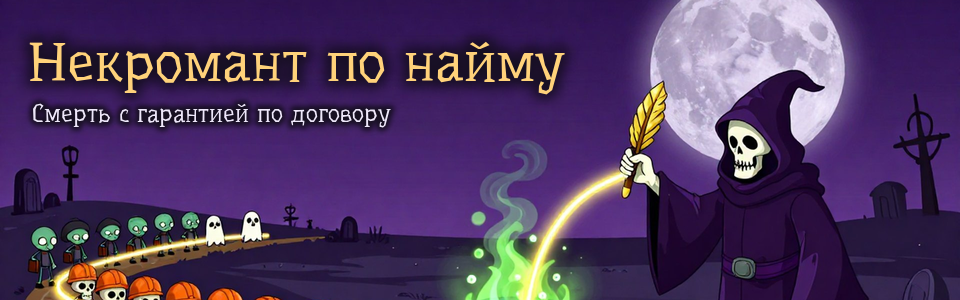
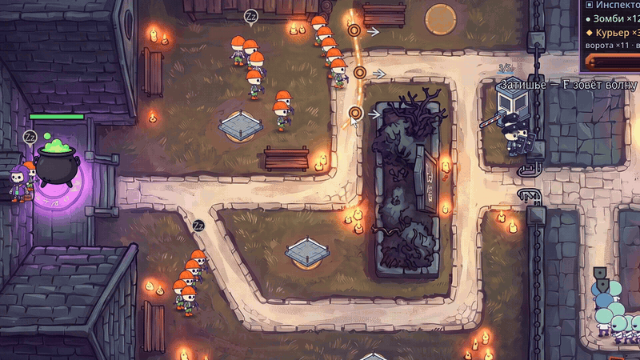
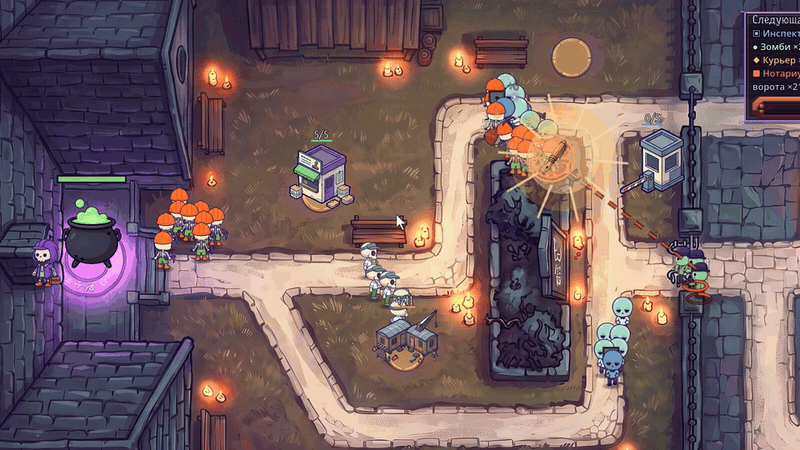
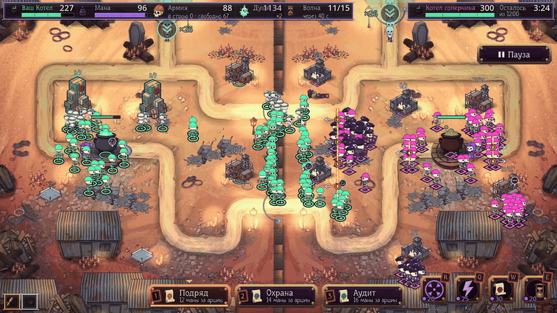
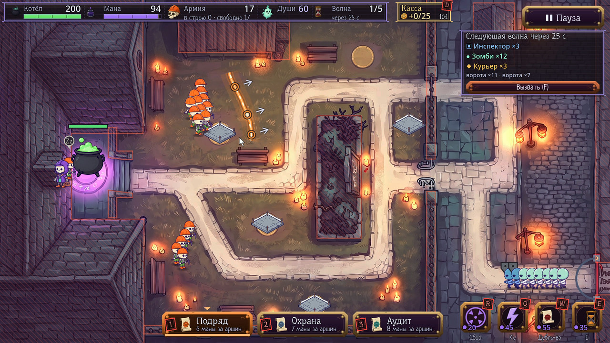
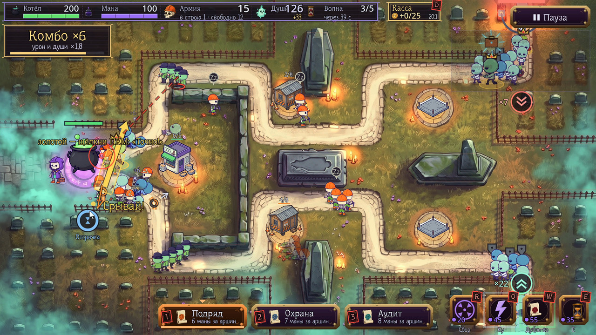
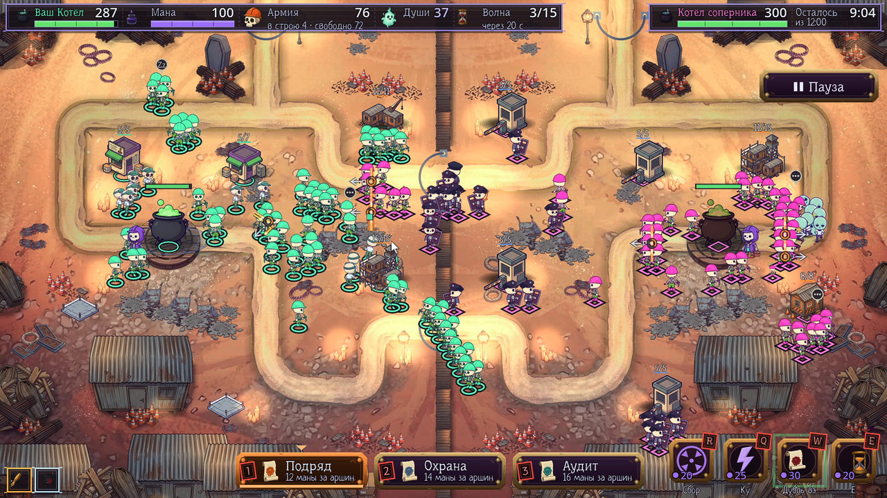
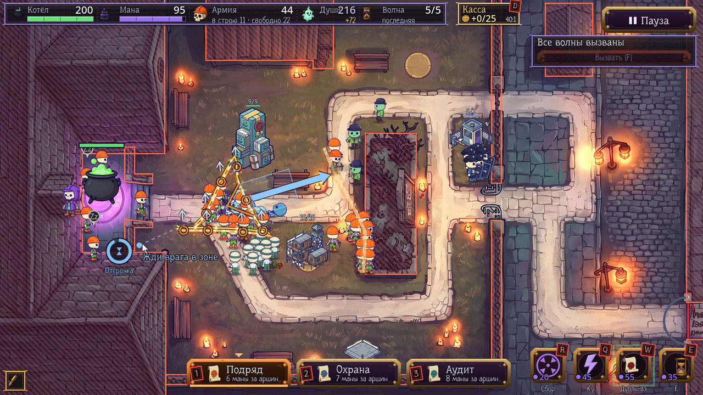

<p align="center"></p>

# Некромант по найму · Necromancer for Hire

**Рисуешь мышью договор — скелеты-подрядчики встают в строй и держат проверяющих из Ада на подходе
к Котлу Душ.** Tower defense, экшен и рогалик в одной игре. Бесплатно, для Windows, на русском, 16+.

[**Скачать для Windows**](https://github.com/Pianist13r/necromancer-for-hire/releases/download/0.2.2-alpha/NecromancerForHire-Windows.exe) ·
[Сайт игры](https://nekromant-po-naimu.website.yandexcloud.net) (открывается в России без VPN) ·
[Все сборки](https://github.com/Pianist13r/necromancer-for-hire/releases) ·
[itch.io](https://pianist13r.itch.io/necromancer-for-hire) ·
[Оставить отзыв](https://forms.yandex.ru/u/6ac606b3f47e73002a8eaf4e)

**Альфа-версия 0.2.2-alpha.** Сделано на Godot 4.7.2.

| Рисуешь договор | Колдуешь | «Схватка» |
|---|---|---|
|  |  |  |
| Линия тает участками и отпускает бойцов в натиск | Молния по цепи, подъём трупов, «Аврал» | Разрушь Котёл соперника первым |

Договор истекает участками, и отпущенные бойцы идут в натиск. Форма тоже тактика: круг —
«Оцепление», квадрат — «Каре», треугольник — «Обряд». Кампания на нарисованных картах,
бесконечный подряд с генератором карт, вызов дня и «Схватка» — против бота или по сети.

| | |
|---|---|
|  |  |
|  |  |

Кадры и ролики сняты в самой игре, из записей живых партий; в роликах добавлены титры и музыка игры.

## Что нового в версии 0.2.2-alpha

**Между боями — меньше экранов и щелчков.** Отдельной «Конторы» больше нет: подготовка («Подъёмные»,
«Термос некроманта») стоит строками с ценой прямо на брифинге над «В бой», щелчок — взять или снять. Что взято
перед прошлым боем, на следующем брифинге берётся само, если хватает премии и есть место.

**Одно «Досье».** Вместо «Героя» и двух разных досье — один экран: разряд и опыт, три поправки
договора, артефакты кампании и каталог всех 20 карт. Открывается из меню и из паузы, а на брифинге
блок «Действует» показывает подписанные поправки и артефакты.

**Поправку сначала выбирают, потом подписывают.** Щелчок по строке выделяет её и раскрывает описание,
подписывает кнопка «Подписать «…»» (двойной щелчок — сразу). Само ничего не подписывается.

**Понятнее итог боя и тексты.** «Новый разряд N — открыта поправка «…»» и строка о том, на что идёт
премия и зачем опыт; молния Ку везде называется одинаково; цена маны за аршин договора учитывает поправки.

**Окна подтверждения в стиле игры** вместо серого системного «Please Confirm…».

## Скачать

[**Сайт игры — скачать и оставить отзыв**](https://nekromant-po-naimu.website.yandexcloud.net) (в России
открывается без VPN) · [страница на itch.io](https://pianist13r.itch.io/necromancer-for-hire).
Для игры не нужно устанавливать Git или скачивать исходники.

| Система | Файл | Как запустить |
|---|---|---|
| **Windows 10/11** | [**NecromancerForHire-Windows.exe**](https://github.com/Pianist13r/necromancer-for-hire/releases/download/0.2.2-alpha/NecromancerForHire-Windows.exe) — один файл, установка не нужна | Скачать и запустить. Если Windows покажет «Windows защитила ваш компьютер» (файл без цифровой подписи): «Подробнее» → «Выполнить в любом случае» |
| Windows, архивом | [NecromancerForHire-Windows.zip](https://github.com/Pianist13r/necromancer-for-hire/releases/download/0.2.2-alpha/NecromancerForHire-Windows.zip) | Распаковать целиком, запустить `Necromancer.exe` (рядом должен лежать `Necromancer.pck`) |
| **macOS: Intel 11.0+ / Apple Silicon 13.0+** | [**NecromancerForHire-macOS.zip**](https://github.com/Pianist13r/necromancer-for-hire/releases/download/0.2.2-alpha/NecromancerForHire-macOS.zip) | Распаковать, перенести приложение в «Программы». Сборка с подписью ad-hoc, без нотаризации Apple: при первом запуске разрешить открытие в «Системные настройки» → «Конфиденциальность и безопасность» → «Открыть в любом случае» |
| **Linux** x86_64 | [**NecromancerForHire-Linux.tar.gz**](https://github.com/Pianist13r/necromancer-for-hire/releases/download/0.2.2-alpha/NecromancerForHire-Linux.tar.gz) | `tar -xzf NecromancerForHire-Linux.tar.gz` и запустить `./Necromancer/Necromancer.x86_64` |

Windows и Linux: x86_64, видеокарта и драйвер с поддержкой Vulkan.
macOS: универсальная сборка для Intel и Apple Silicon, графика с поддержкой Metal.
Сборка macOS проверена структурно, на настоящем Mac пока не запускалась. Все версии — на странице
[Releases](https://github.com/Pianist13r/necromancer-for-hire/releases).

Прогресс кампании и настройки хранятся отдельно от игры и переживают обновление:
Windows — `%APPDATA%\Godot\app_userdata\Некромант на аутсорсе\`,
macOS — `~/Library/Application Support/Godot/app_userdata/Некромант на аутсорсе/`,
Linux — `~/.local/share/godot/app_userdata/Некромант на аутсорсе/`
(папка носит прежнее название игры — так прогресс тестеров не потерялся).

Чтобы обновиться: откройте «Настройки» → «О игре» → «Версии и обновления»
или страницу Releases и скачайте нужный выпуск. Закройте игру, затем замените exe или распакуйте новую сборку
целиком в отдельную папку. Папку сохранений удалять не нужно: новая версия найдёт прогресс
и настройки сама. Версия установленной игры видна в разделе «О игре».

## Онлайн («Схватка» по сети)

Меню → «Схватка» → «По сети». Для нового профиля адрес уже заполнен:

```
wss://51-250-12-39.sslip.io
```

Если играли в старой версии, сначала нажмите «Обновить адрес»: сохранённый адрес прежнего
сервера не заменяется автоматически. Эта же кнопка пригодится при следующем переезде.
Игра прочитает только адрес из публичного
[`server.json`](https://raw.githubusercontent.com/Pianist13r/necromancer-for-hire/main/server.json)
ветки `main` этого репозитория. Без сети или при недоступном файле останется текущий адрес.
Адрес можно ввести вручную; для локального сервера допустим `ws://localhost:порт`.
Версии клиента и сервера должны совпадать: если лобби
пишет про другую сборку, скачайте свежий выпуск.

## Управление

- **ЛКМ, протяжка** — начертить договор; **колесо / 1–3** — выбрать вид.
- **ПКМ по строю** — выпустить бойцов; оттяжка ПКМ — направленный натиск.
- **Пробел или зажатое колесо** — задать стрелку; **Таб** — стереть участок.
- **Q / W / E** — навыки: зажать для прицеливания, отпустить для применения.
- **R** — сбор к курсору, **F** — вызвать следующую волну, **D** — Касса в одиночке.
- **Esc / P** — пауза одиночного боя; в сетевом матче бой продолжается.

Обучение и полная справка — в самой игре («Как играть»).

## Ошибки, идеи, правки

При первом запуске игра предлагает добровольно поделиться статистикой: версия, система,
сеансы и время активного боя. По умолчанию отправка выключена; выбор можно изменить
в настройках. Имена, сохранения и полные логи не отправляются. [Подробности](PRIVACY.md).

- Нашли ошибку или есть идея — [Issues](https://github.com/Pianist13r/necromancer-for-hire/issues):
  система, версия, что делали, по возможности скриншот.
- Хотите прислать код, арт или баланс — pull request; порядок и соглашение контрибьютора —
  [CONTRIBUTING.md](CONTRIBUTING.md).

## Поддержать игру

Нравится игра? Поддержать разработку можно на
[DonationAlerts](https://www.donationalerts.com/r/pianist13r). Игра остаётся бесплатной,
поддержка добровольная.

## Собрать из исходников

1. Godot **4.7.2** (обычная сборка, не .NET) — https://godotengine.org.
2. Открыть проект `godot/project.godot` или запустить:
   `godot --path godot` (игра), `godot --headless --path godot --import` (после новых классов).
3. Проверка перед pull request: `tools/legion_gate.sh` (Git Bash на Windows) — последняя строка
   должна быть `GATE OK`. Нужны `gdlint` (`pip install gdtoolkit==4.*`) и путь к движку в переменной
   `GODOT` (`GODOT=/путь/к/godot tools/legion_gate.sh`). Тесты запускайте с отдельной папкой данных
   (`APPDATA=...`) и `--mute`.

Комментарии в коде местами ссылаются на внутренние заметки разработки (номера решений D-…,
находок B-…, файлы `docs/…`) — эти заметки в репозиторий не входят.

## Лицензия

**Исходный код открыт, но это не «open source» в строгом смысле**: код — под
[PolyForm Noncommercial 1.0.0](LICENSE.md) (бесплатно для любого некоммерческого использования),
графика, музыка, озвучка, тексты и персонажи — [все права у автора](ASSETS_LICENSE.md), играть,
стримить и снимать видео — можно. Название и логотип — [товарные знаки](TRADEMARKS.md).
Сводка — [LICENSING.md](LICENSING.md), чужие компоненты — [THIRD_PARTY_NOTICES.md](THIRD_PARTY_NOTICES.md).

© 2026 Губанов Игорь Андреевич (Igor Andreevich Gubanov).
